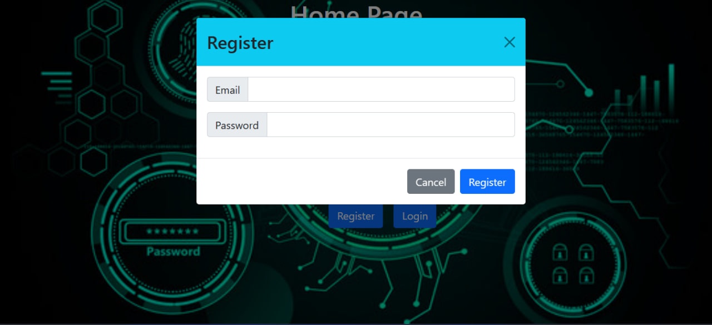
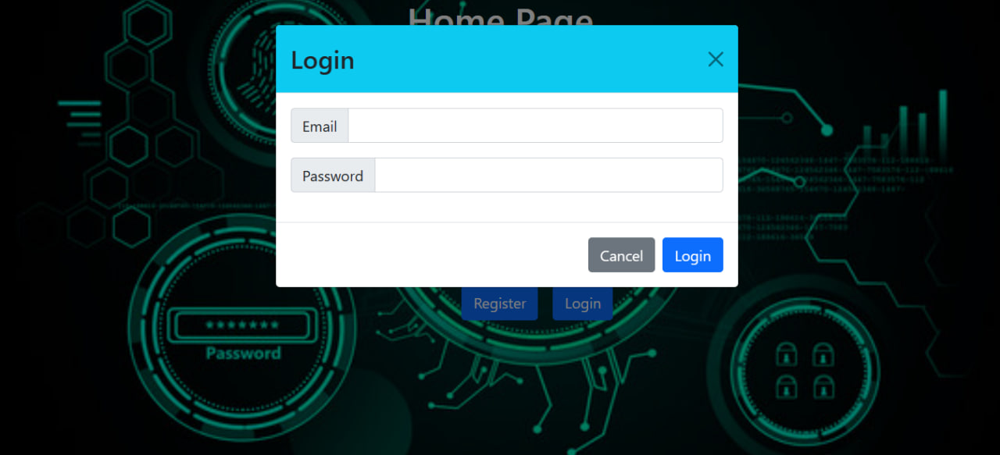
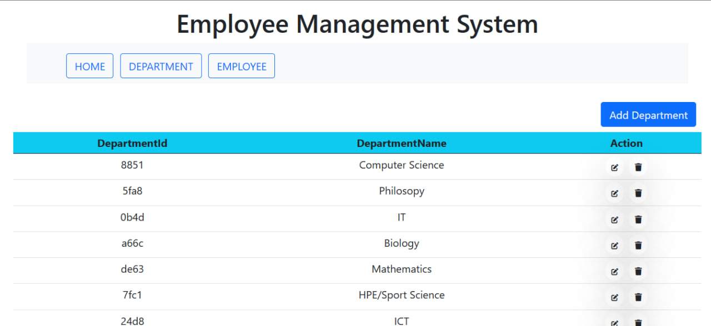
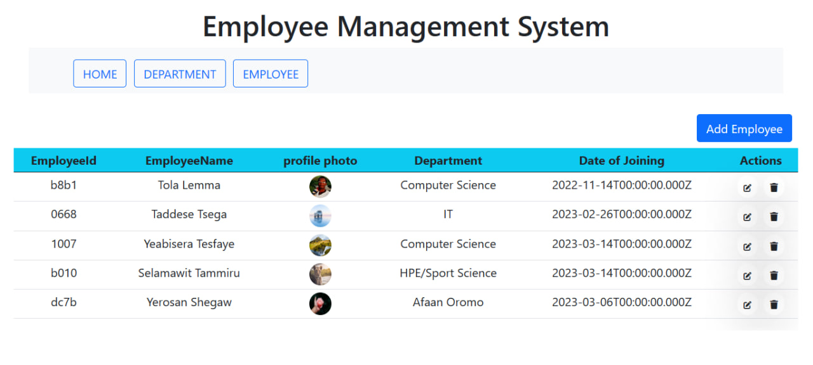
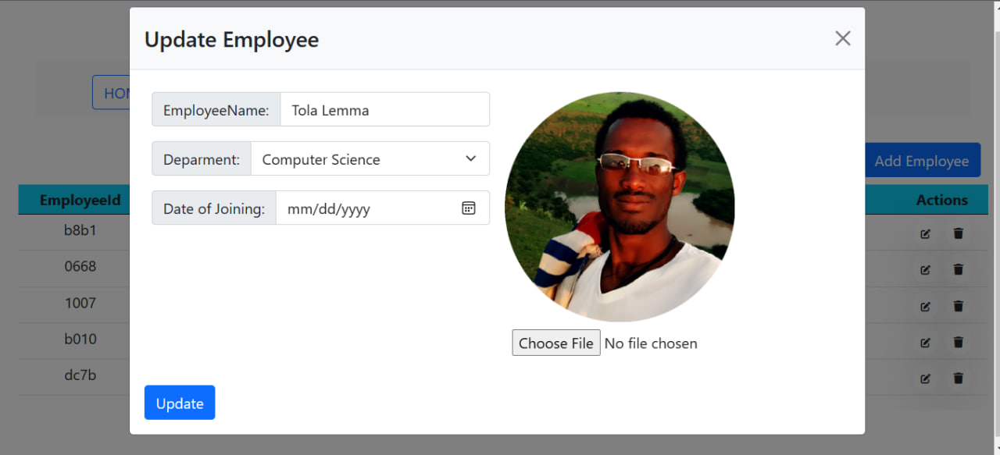

# Employee Management System
This is a web application for managing employees and departments using the MERN stack (MongoDB, Express, React, Node.js) and Authentication and Authorization with JWT(jsonwebtoken)

# Features
- Add new departments
- Delete existing departments
- Update existing departments
- Create new employees with profile photo
- View employee details
- Update employee details
- Delete employees
- All routes are Authorized
# Prerequisites
- Node.js 
- MongoDB 
# Installation
- Clone the repository:
git clone https://github.com/Tola-lemma/Employee-management-using-MERN-stack.git
- Install dependencies:
`npm install`
- Create a `.env` file and add your MongoDB connection URI:
     touch `.env`
    echo `MONGODB_URI`= <your-mongodb-uri>" "  `.env`
     Start the server:
`npm run server`
# Screenshots
 <strong> Registeration page</strong>
 
     <strong> Login page</strong>
  
  <strong> Department page</strong>

<strong> Employee page</strong>

<strong> Update Employee </strong>

# Contributing
Contributions are welcome! Please open a pull request or issue on GitHub to get started.